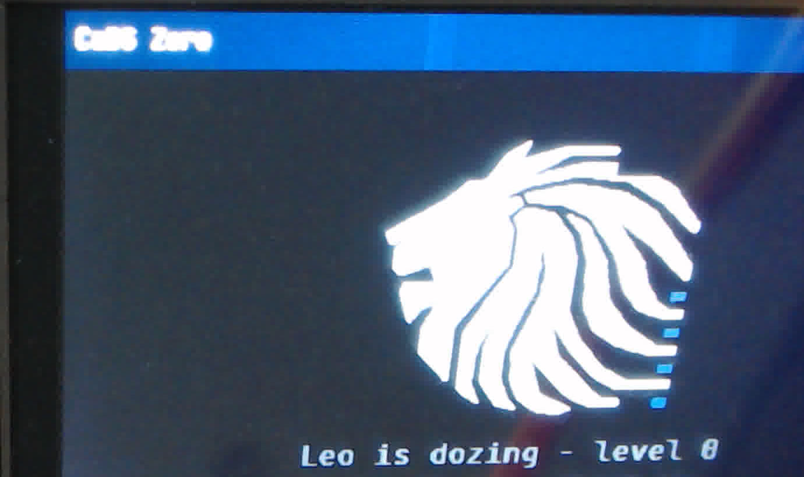

# 00 · Onboarding

<a class="md-button" href="../../pdf/00-onboarding.pdf">:material-file-pdf-box: Als PDF herunterladen</a>

!!! info "Termin T01 · Setup S1"
    Dieser Versuch läuft im Netz-Setup **S1 – statische Adresse**
    (siehe [Netz-Setup](../reference/netz-setup.md#s1-statische-adresse)).

--8<-- "konventionen.md"

In diesem ersten Termin richtet ihr die Werkzeugkette ein, die ihr in allen
folgenden Versuchen braucht: Firmware im Browser bauen, per WebUSB auf das
ITS-Board flashen, das Board per Ethernet an euren eigenen Rechner hängen und
von dort aus ansprechen. Am Ende steht die erste Messung des Praktikums: die
Umlaufzeit (Round-Trip Time, RTT) eines `ping` zum Board – und die Frage,
warum sie so viel größer ist, als die Leitung allein erklärt.

## Lernziele

Nach dem Versuch könnt ihr …

- das Image **CADS Firmware-Labor** starten, euren Fork der Firmware
  auschecken, die Firmware bauen und per WebUSB flashen,
- auf **eurem** Betriebssystem (macOS, Windows oder Linux) der
  Board-Schnittstelle eine statische Adresse geben (Setup S1) und prüfen, ob
  sie auf der richtigen Schnittstelle gelandet ist,
- mit `lab info` den Netzzustand des Boards ablesen (Adresse, Maske, MAC, Link,
  Zähler) und mit `ping` die Erreichbarkeit prüfen,
- eine RTT aus ihren Bestandteilen abschätzen (Serialisierung, Ausbreitung,
  Verarbeitung/Wartezeit) und Schätzung und Messung begründet vergleichen.

## Theorie-Bezug (Skript 5.2, 5.9)

- Kapitel 4 des Skripts beschreibt ein anderes, softwarebasiertes Praktikum
  (Chat-Protokoll) und gilt für dieses Board-Praktikum **nicht**. Die
  Aufgabenblätter hier folgen stattdessen immer demselben Muster: erst einen
  Erwartungswert herleiten, dann messen, dann die Abweichung erklären.
- Fachlich greift dieser Termin vor auf **5.2 (Bitrate und Bandbreite)**:
  die **Bitdauer** bei 100 Mbit/s ist 10 ns; ein Byte belegt die Leitung also
  80 ns. Daraus folgt die Zeit, die ein Frame zum Senden braucht
  (Serialisierung).
- Und auf **5.9 (Referenzmodelle)**: `ping` benutzt ICMP, das zur
  Internetschicht des TCP/IP-Modells (OSI-Schicht 3) gehört – es gibt keine
  Transport- und keine Anwendungsschicht dazwischen. Gemessen wird also im
  Wesentlichen, wie schnell die unteren Schichten und die Verarbeitung in
  beiden Endsystemen sind.

## Versuchsaufbau

```text
 Eigener Rechner                                           ITS-Board
 ┌───────────────────────────────┐   USB (ST-Link)   ┌──────────────────┐
 │ Browser: Image CADS Firmware- │───────────────────│ Flashen, serielle│
 │   Labor (bauen, flashen,      │                   │ Konsole 115200 Bd│
 │   serielle Konsole)           │                   │                  │
 │ Wireshark, rnlab.py, ping     │    Ethernet       │                  │
 │ Board-Schnittstelle           │═══════════════════│ 192.168.33.99/24 │
 │   192.168.33.10/24            │  (Patchkabel)     │ MAC s. lab info  │
 └───────────────────────────────┘                   └──────────────────┘
```

- **Image** CADS Firmware-Labor im Browser (Chrome oder Chromium – nur diese
  sind für WebUSB/WebSerial erprobt): bauen, flashen, serielle Konsole. Das Image läuft auf
  einem Server; es sieht euer lokales Netz **nicht**.
- **Eigener Rechner:** Board-Schnittstelle im Setup **S1** mit
  `192.168.33.10/24`, ohne Gateway. Dort laufen `ping`, Wireshark und
  [`rnlab.py`](../reference/rnlab-tool.md).
- **Board** nach dem Flashen: `192.168.33.99/24`, Telnet-CLI auf TCP-Port 4242
  (für `rnlab.py`), dieselbe CLI auf der seriellen Konsole.

## Versuchsablauf

!!! warning "Stand des Zugangs"
    Die Image-Auswahl im Portal wird zum Semesterstart freigeschaltet. Bis
    dahin erhaltet ihr den Zugang zum Firmware-Labor von der Betreuung. Die
    Schritte 1–4 beschreiben den Ablauf ab Semesterstart; sie werden zur
    Abnahme mit dem echten Image geprüft und hier bei Abweichungen angepasst.

### 1. Image starten

Ab Semesterstart: Portal öffnen, **vor** der Anmeldung das Image
**CADS Firmware-Labor** wählen und per Single-Sign-on anmelden. Nach der
Anmeldung prüft das Portal, ob das Image für eure Gruppe freigegeben ist.
Bis dahin gilt der Zugang, den ihr von der Betreuung bekommt. Details stehen in
[Firmware-Labor-Image](../reference/firmware-lab-image.md#image-wahlen-und-anmelden).

### 2. Arbeitsbereich und eigener Fork

Ab Semesterstart öffnet das Image den Arbeitsbereich `cads-zero` mit dem
Stand `praktikum/start` der Firmware bereits fertig, samt Submodulen und
vorbereiteten Tasks – ihr müsst nichts klonen. Eure Änderungen gehören in
euren eigenen Fork **`cads-zero-firmware`** im GitLab der Hochschule:

1. Im GitLab das Projekt `cads-zero-firmware` in euren Namespace **forken**
   (einmalig).
2. Ab Semesterstart ist der Arbeitsbereich im Image direkt euer Fork. Bis
   dahin – oder falls `git remote -v` noch nicht euren Fork zeigt – verbindet
   ihr den vorbereiteten Arbeitsbereich selbst mit eurem Fork
   (*☰ → Terminal → New Terminal*):

    ```bash
    git remote -v                                   # zeigt, wohin origin zeigt
    git remote rename origin vorlage
    git remote add origin <HTTPS-Adresse eures Forks>
    git fetch origin
    git switch praktikum/start 2>/dev/null || git switch -c praktikum/start --track origin/praktikum/start
    git branch --set-upstream-to=origin/praktikum/start
    git submodule update --init --recursive        # lwIP und littlefs
    ```

    Der Arbeitsbereich behält dabei Stand, Build und Tasks; nur das Ziel von
    `git push` ändert sich. Den Fork in einen anderen Ordner zu klonen geht
    auch, dort fehlen aber die vorbereiteten Tasks des Images.

3. Ab jetzt je Versuch committen und pushen; eure Stellen im Quelltext sind mit
   `TODO(LNN)` markiert (z. B. `TODO(L01)`).

### 3. Bauen

*☰ → Terminal → Run Task… → **CaDS: Build*** (die Tasks `CaDS: …` richtet das
Image beim Start ein; außerhalb des Images heißen die Tasks aus
`.vscode/tasks.json` z. B. „Build: ITSboard firmware“) oder im Terminal:

```bash
cmake --preset itsboard && cmake --build build/itsboard
```

Das Ergebnis liegt in `build/itsboard/cads-zero.bin`. Die Host-Tests (reine
Logik, ohne Board) laufen ab Semesterstart mit der Task **CaDS: Host tests
(Rahmen)**, die Tests eines Versuchs mit **CaDS: Lektionstests** (fragt nach der
Nummer; heutige Instanz: **CaDS: Host tests**, die auch die roten Lektionstests
mitlaufen lässt) oder im Terminal:

```bash
cmake --preset host && cmake --build build/host
ctest --test-dir build/host -LE '^rnlab-L'   # Rahmen: muss grün sein
```

Die Tests der Lektionen (`ctest --test-dir build/host -L '^rnlab-L01$'` usw.)
sind auf `praktikum/start` absichtlich rot, bis ihr die jeweilige Aufgabe
gelöst habt.

### 4. Board verbinden und flashen

Board per USB an die **ST-Link-Buchse** (Micro-USB am Nucleo) anschließen.
Die Befehle stehen in der Befehlspalette (*F1*); dort erscheinen sie mit dem
Präfix der Erweiterung, also z. B. als „CaDS: CaDS Board: Verbinden …“ – tippt
einfach „CaDS Board“.

1. *F1 → **CaDS Board: Verbinden (USB/Serial freigeben)*** (oder in der
   Statusleiste links unten auf „Board: getrennt“ klicken). Der Browser fragt
   zweimal: zuerst nach dem USB-Gerät („STM32 STLink“), dann nach der
   seriellen Schnittstelle des ST-Link.
2. *F1 → **CaDS Board: Flash (build/itsboard/cads-zero.bin)*** oder die Task
   **CaDS: Build + Flash**. Fortschritt und Ergebnis erscheinen als
   Benachrichtigung („Flash ok: … Bytes“).

=== "macOS"

    macOS hängt beim Einstecken ein Laufwerk `NOD_F429ZI` ein und schreibt
    Metadaten darauf – das kann den Flash-Inhalt beschädigen. Nach jedem
    Einstecken aushängen:

    ```bash
    diskutil list external          # Datenträger NOD_F429ZI suchen, z. B. disk4
    diskutil unmountDisk /dev/disk4
    ```

=== "Windows"

    Chrome/Chromium greifen per WebUSB nur auf das ST-Link zu, wenn dessen
    Debug-Schnittstelle den **WinUSB**-Treiber hat. Fehlt er (Gerät erscheint
    im Dialog nicht oder lässt sich nicht öffnen), mit
    [Zadig](https://zadig.akeo.ie/) für „STM32 STLink“ WinUSB installieren.
    STM32CubeProgrammer und andere ST-Werkzeuge vorher schließen.

=== "Linux"

    Der Browser braucht Schreibrechte auf das USB-Gerät: udev-Regel für das
    ST-Link (`49-stlinkv2-1.rules`, Paket `stlink-tools` bzw. aus dem
    stlink-Projekt) und für die serielle Konsole die Gruppe `dialout`:

    ```bash
    sudo usermod -aG dialout "$USER"   # danach neu anmelden
    ```

    Browser aus Snap/Flatpak sehen USB-Geräte oft nicht; dann ein Paket aus
    der Distribution oder von Google/Microsoft verwenden.

Nur **ein** Browser-Tab kann das Board gleichzeitig halten.

So sieht das Display des Referenzboards nach dem Flashen aus (Startbildschirm
mit dem Maskottchen Leo):

{ width="480" }

### 5. Serielle Konsole

Öffnet die serielle Konsole des Boards wie in
[Serielle Konsole](../reference/serielle-konsole.md) beschrieben (im Image oder
lokal). Auf dem Display läuft nach dem Boot das Menü; die Konsole nimmt
trotzdem `lab`-Befehle an. Eingeben:

```text
lab info
```

Die Konsole braucht kein Netz. Sie ist euer Rettungsweg, wenn später einmal
die Telnet-Verbindung abreißt (z. B. in Versuch 03).

Die Tasten des Boards lassen sich von hier aus fernbedienen: `lab key ok`
öffnet vom Startbildschirm das Menü „Applications“, `lab key down` und
`lab key back` bewegen sich darin (`lab key` ohne Argument listet alle
Tasten). Dasselbe geht später auch per Telnet über `rnlab.py`.

### 6. Netz-Setup S1 auf eurem Rechner

Patchkabel zwischen Board und Rechner stecken, dann der **Board-Schnittstelle**
die Adresse `192.168.33.10/24` geben – ohne Gateway. Die Kurzfassung (Details,
dauerhafte Varianten und das Zurücksetzen stehen in der
[Netz-Setup-Referenz](../reference/netz-setup.md#s1-statische-adresse)):

=== "macOS"

    ```bash
    networksetup -listallhardwareports          # Adapter + Gerät (z. B. en7) finden
    sudo networksetup -setmanual "USB 10/100/1000 LAN" 192.168.33.10 255.255.255.0
    ```

=== "Windows"

    ```powershell
    netsh interface ipv4 show interfaces        # Namen finden, z. B. "Ethernet 2"
    netsh interface ipv4 set address name="Ethernet 2" static 192.168.33.10 255.255.255.0
    ```

    (Eingabeaufforderung **als Administrator**.)

=== "Linux"

    ```bash
    ip -br link                                 # z. B. enx001122334455
    sudo ip addr add 192.168.33.10/24 dev enx001122334455
    ```

Prüfen – `rnlab.py` zeigt, über welche lokale Adresse der Rechner das Board
erreichen würde. Das Werkzeug ist eine einzelne Python-Datei im
Doku-Repository ([`tools/rnlab.py`](../reference/rnlab-tool.md), nur
Standardbibliothek); ruft es aus dessen Wurzelverzeichnis auf (Windows:
`py tools\rnlab.py …`):

```bash
python3 tools/rnlab.py check --board 192.168.33.99
```

### 7. `lab info` und ping vom eigenen Rechner

```bash
python3 tools/rnlab.py lab 192.168.33.99 "lab info"
```

Erwartete Ausgabe (die Zähler und die Uptime sind bei euch andere):

```text
> lab info
ip:     192.168.33.99
mask:   255.255.255.0
gw:     192.168.33.1
dns:    keine
mac:    xx:xx:xx:xx:xx:xx
link:   up 100M full
dhcp:   aus (statisch)
dhcp_naks: 0
rx:     37 Frames (0 verworfen)
tx:     29 Frames
rx_ring_overruns: 0 (FIFO: 0)
nested: 0 verschachtelte Polls abgewiesen
poll:   10 ms
uptime: 45210 ms
```

- **`mac`**: Die MAC-Adresse eures Boards (die `xx` stehen bei euch für
  konkrete Hex-Ziffern). Ist auf dem Board `net.mac_random` gesetzt, steht
  hier bei jedem Neustart eine andere Adresse – lest sie deshalb immer hier
  ab. Was die untersten Bits des ersten Oktetts bedeuten, klärt Versuch 02.
- **`link: up 100M full`**: PHY und Rechner haben 100 Mbit/s Vollduplex
  ausgehandelt. Mit dieser Bitrate rechnet ihr unten.
- **`rx`/`tx`**: Ethernet-Frames seit dem Boot. Schickt einen Ping und ruft
  `lab info` erneut auf: Um wie viel wachsen die Zähler, und warum um mehr als
  einen Frame?

Dann die RTT messen – erst ein kurzer Blick mit Histogramm (1-ms-Klassen),
dann die beiden Messreihen als Datei für die Auswertung:

```bash
python3 tools/rnlab.py ping 192.168.33.99 -c 100 -i 0.2 -s 56 --hist 1
python3 tools/rnlab.py ping 192.168.33.99 -c 100 -i 0.2 -s 56 --json > ping56.json
python3 tools/rnlab.py ping 192.168.33.99 -c 100 -i 0.2 -s 1472 --json > ping1472.json
```

Parallel in Wireshark auf der Board-Schnittstelle mitschneiden (Anzeigefilter
`icmp || arp`) und die Zeitdifferenz Request → Reply eines Paares ablesen.

## Erwartungswert (vor der Messung notieren!)

Schätzt die RTT eines Standard-Pings (56 Byte ICMP-Daten) **bevor** ihr messt.
Die RTT setzt sich aus Beiträgen je Richtung zusammen:

| Beitrag | Rechenweg | Euer Wert |
|---|---|---|
| Serialisierung eines Frames | Bytes auf dem Draht × 80 ns (100 Mbit/s). Frame = 14 B Ethernet + 20 B IPv4 + 8 B ICMP + 56 B Daten + 4 B FCS, dazu 8 B Präambel/SFD und 12 B Pause | |
| Ausbreitung | 2 m Kabel, Signal mit ≈ 2·10⁸ m/s | |
| Verarbeitung im Rechner | Betriebssystem + USB-Ethernet-Adapter, Größenordnung 0,1 ms | |
| Verarbeitung im Board | siehe unten | |
| **RTT = 2 × (Serialisierung + Ausbreitung) + Verarbeitung** | | |

Für das Board gilt: lwIP läuft hier **ohne Betriebssystem-Threads**
(`NO_SYS=1`). Niemand wird durch einen Interrupt geweckt, wenn ein Frame
ankommt; stattdessen fragt die Hauptschleife der Firmware den Netztreiber
regelmäßig ab (**Polling**). Solange das Menü auf dem Display läuft, geschieht
das etwa **alle 10 ms**. Ein Echo Request kann zu einem beliebigen Zeitpunkt
zwischen zwei Abfragen eintreffen.

!!! question "Kurz nachgedacht"
    1. Wie groß ist die RTT **ohne** das Polling (nur Leitung und Rechner)?
    2. Welche kleinste, größte und mittlere RTT erwartet ihr **mit** einem
       Polling-Abstand von 10 ms? Welche Verteilung der Einzelwerte?
    3. Ändert sich die RTT spürbar, wenn ihr statt 56 Byte 1472 Byte Daten
       schickt (`rnlab.py ping … -s 1472`)? Rechnet die zusätzliche Serialisierungszeit aus.

## Experiment (Firmware-Aufgabe)

In diesem Termin schreibt ihr noch keinen eigenen Code. Die Aufgabe ist, die
Kette **Fork → Build → Flash → Netz → Messung** einmal vollständig und
nachvollziehbar durchlaufen zu haben:

1. Fork mit Branch `praktikum/start` im Image, Build ohne Fehler,
   `ctest --test-dir build/host -LE '^rnlab-L'` grün.
2. Firmware aus **eurem** Build geflasht; `lab info` über die serielle
   Konsole **und** über `rnlab.py` (Telnet) liefert dieselbe IP und MAC.
3. Ping-Messreihe mit je 100 Werten (56 B und 1472 B) als Datei
   gesichert (`rnlab.py ping … --json > ping56.json`).
4. Ein Wireshark-Mitschnitt mit mindestens einem Echo Request/Reply-Paar.

Der Rahmen, den ihr ab Versuch 01 erweitert, liegt in
in eurem Fork: [`apps/rnlab/`](https://github.com/scimbe/cads-zero-firmware/blob/praktikum/start/apps/rnlab/README.md):
der Befehl `lab` in
[`src/rnlab.c`](https://github.com/scimbe/cads-zero-firmware/blob/praktikum/start/apps/rnlab/src/rnlab.c)
(`lab info` ist dort `rnlab_cmd_info()`), die Lektionsdateien
`src/lNN_<slug>.c` und `src/lNN_<slug>_logic.c`. Werft einen Blick hinein: Wo
kommen die Zähler `rx`/`tx` her?

## Auswertung

1. Tragt Minimum, Mittelwert, Maximum und Standardabweichung eurer Messreihe
   (56 B und 1472 B) neben den Erwartungswert. Stimmt die Größenordnung?
2. Zeichnet ein Histogramm der 100 RTT-Werte (Klassenbreite 1 ms). Welche
   Verteilung erkennt ihr, und was sagt sie über den Polling-Abstand?
3. Vergleicht die RTT aus `ping` mit der Zeitdifferenz Request → Reply in
   Wireshark. Welche Anteile der RTT sieht Wireshark nicht?
4. Welche Zahl in `lab info` würde sich ändern, wenn ihr das Kabel an einen
   Switch mit 10 Mbit/s steckt, und wie ändert sich dann eure Rechnung?

--8<-- "issue-feedback.md"

## Potenzielle Herausforderungen

- **„Request timeout“ / „Zielhost nicht erreichbar“:** Adresse auf der
  falschen Schnittstelle (`rnlab.py check` zeigt die gewählte Quelladresse),
  Kabel nicht gesteckt (`lab info`: `link: down`) oder – unter Windows – die
  Firewall fragt nach dem Netzwerktyp der neuen Verbindung.
- **Pings gehen nach einem Board-Reset verloren:** Das betrifft nur Boards
  mit `net.mac_random` (MAC in `lab info` ändert sich bei jedem Boot). Euer
  Rechner hat dann noch die alte MAC im ARP-Cache und schickt ins Leere, bis er
  den Eintrag verwirft oder neu fragt (am Referenzplatz fragte macOS nach
  einigen erfolglosen Unicast-Anfragen wieder per Broadcast; Linux verwirft
  die Einträge einer Schnittstelle schon beim Link-Verlust des Resets).
  Abhilfe: auf dem Board `lab 02 garp` (ab Versuch 02).
- **Kein Board im WebUSB-Dialog:** falsche USB-Buchse (es muss die des
  ST-Link sein), anderer Tab oder ein ST-Werkzeug hält das Gerät, unter
  Windows fehlt WinUSB, unter Linux die udev-Regel.
- **`telnet` statt `rnlab.py`:** Einige `telnet`-Clients handeln beim
  Verbinden Optionen aus; nutzt `rnlab.py` oder `nc`
  ([rnlab.py-Referenz](../reference/rnlab-tool.md#lab-telnet)).
- **Ping nur über `rnlab.py`:** Das System-`ping` hat je Betriebssystem
  andere Optionen, und unter Windows misst es nur ganze Millisekunden.
  `rnlab.py ping` liefert überall dieselbe Statistik (Median, p90/p99,
  Standardabweichung) und mit `--json` alle Einzelwerte.

## Quellen

- RN-Skript, Kap. 5.2 (Bitrate und Bandbreite) und 5.9 (Referenzmodelle).
- RFC 792 – Internet Control Message Protocol (Echo/Echo Reply).
- IEEE 802.3, Abschn. 4.4 (Interframe Gap: 96 Bitzeiten) und 3.2
  (Präambel/SFD).
- lwIP-Dokumentation, „Mainloop mode (NO_SYS)“:
  <https://www.nongnu.org/lwip/2_1_x/group__lwip__nosys.html>
- [Netz-Setup](../reference/netz-setup.md),
  [Firmware-Labor-Image](../reference/firmware-lab-image.md),
  [rnlab.py](../reference/rnlab-tool.md).
