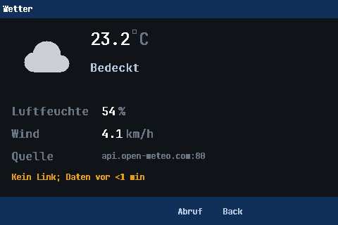

# 11 · Wetter-App

<a class="md-button" href="../../pdf/11-wetter-app.pdf">:material-file-pdf-box: Als PDF herunterladen</a>

!!! info "Termin T12 · Setup S2"
    Dieser Versuch läuft im Netz-Setup **S2 – Internetfreigabe**
    (siehe [Netz-Setup](../reference/netz-setup.md#s2-internetfreigabe)).
    Für die Entwicklung und die Blit-Messung reicht **S1** mit dem lokalen
    Wetter-Testserver aus Versuch 10.

--8<-- "konventionen.md"

Aus dem Befehl `lab 10 get` wird ein Gerät: Die Wetterstation zeigt die
aktuellen Werte auf dem Display, holt alle zehn Minuten neue, übersteht
gezogene Kabel, tote Server und kaputte Antworten und sagt jederzeit ehrlich,
wie alt das Angezeigte ist. Die eigentliche Netzfrage steckt im Display: Es
teilt sich einen Pin mit dem Ethernet-Empfänger. **Jedes Neuzeichnen schaltet
den Empfang ab.** Eine gute App zeichnet deshalb so wenig wie möglich – und ihr
messt, was das in verlorenen Frames bedeutet.

## Lernziele

Nach dem Versuch könnt ihr …

- einen HTTP-Client in eine Anwendung mit Zeitsteuerung einbetten:
  zyklischer Abruf, Wiederholung mit exponentiellem Backoff, Zeitüberschreitung,
- Fehlerzustände einer Netzanwendung unterscheiden (kein Link, keine Adresse,
  DNS, Verbindung, HTTP-Status, Anwendungsdaten) und für Benutzer verständlich
  anzeigen,
- Steuerlogik so von Netz und Anzeige trennen, dass sie mit einer
  Test-Uhr auf dem Rechner geprüft werden kann,
- den Zielkonflikt Anzeige ↔ Empfang (gemeinsamer Pin PA7) quantitativ
  abschätzen und mit Dirty Rectangles minimieren,
- die Werte der App gegen eine unabhängige Referenz (`curl`) abnehmen.

## Theorie-Bezug (Skript 5.36)

- Die App ist ein **RESTful-API-Client** (5.36): Ein Programm fragt eine
  Ressource ab (`GET /v1/forecast?…`) und verarbeitet die Daten (JSON) selbst –
  der Request-Reply-Ablauf aus Versuch 10, jetzt periodisch.
- **HTTP-Statuscodes** (5.36) werden zu Anwendungszuständen: 2xx → Werte
  übernehmen; 4xx → Fehler des Clients (Anfrage prüfen, nicht blind
  wiederholen); 5xx → Fehler des Servers (später wieder versuchen).
- **HTTP/1.0 vs. 1.1:** Die App baut für jeden Abruf eine neue Verbindung auf.
  Bei einem Abruf alle zehn Minuten spart eine persistente Verbindung nichts –
  der Server würde sie ohnehin nach kurzer Leerlaufzeit schließen.
- Zyklischer Abruf ist **Polling**: Die Aktualität der Daten ist durch das
  Intervall begrenzt, die Last auf den Server durch die Zahl der Clients mal
  Abrufrate. open-meteo aktualisiert die Werte alle 15 min (`"interval":900`
  im JSON).

## Versuchsaufbau

```
 Board: App "Wetter"  ── Ethernet ──  Rechner: Wireshark, rnlab.py, curl  ── Internet: api.open-meteo.com
        + lab 11                      wetter_testserver.py (lokal, S1/S2)
```

- Setup **S2** für den Abruf aus dem Internet, **S1** oder S2 mit
  `tools/wetter_testserver.py` aus Versuch 10 für alles andere.
  Mit `--vary` liefert der Testserver bei jedem Abruf andere Werte – so gibt es
  auf dem Display bei jedem Abruf etwas zu zeichnen.
- Die App öffnet ihr am Board: nach dem Reset **OK** (Menü), mit **↓** zu
  „Wetter“, **OK**. **OK** in der App ruft sofort ab, **Back** verlässt sie.
  Ohne die Tasten anzufassen geht das per Telnet oder
  [serieller Konsole](../reference/serielle-konsole.md):
  `lab key ok` (Menü), `lab key down 20` („Wetter“ ist der letzte Eintrag;
  seine Position hängt davon ab, welche Apps gebaut sind), `lab key ok`.
  `lab key back` verlässt die App wieder.
- Die App ruft nur ab, **solange sie angezeigt wird**.

!!! info "Umfang"
    **Pflicht (≈ 3 h):** Steuerung und Anzeige (`TODO(L11)` in Logik und App),
    Messungen **A, B, E**. **Vertiefung (optional):** C und D (Redraw-Kosten,
    verlorene Frames). WMO-Tabelle und Layout liefert das Gerüst.

!!! info "Werkzeug: `lab 11`"
    | Befehl | Wirkung |
    |---|---|
    | `lab 11 status` | Statuszeile, Werte, Quelle, Intervall, Abrufe/Fehler, Backoff, Redraw-Messung |
    | `lab 11 server [host[:port]]` | Quelle setzen, z. B. `<rechner>:8080`; ohne Argument open-meteo |
    | `lab 11 interval <s>` | Abrufintervall (10 … 86400 s, Standard 600) |
    | `lab 11 refresh` | sofort abrufen, wie **OK** in der App |

    `lab 11` und die App arbeiten auf **demselben** Zustand. So lenkt ihr die
    Anzeige per Netz auf den Testserver und lest die Messung der App ab, ohne
    das Display anzufassen.

## Versuchsablauf

1. Firmware-Aufgabe umsetzen, Host-Tests grün (`ctest -L '^rnlab-L11$'`), flashen.
2. **Erwartungswerte** notieren (nächster Abschnitt).
3. **A – Funktion mit Testserver:**

    ```bash
    python3 tools/wetter_testserver.py --bind <rechner> --port 8080 --vary   # aus Versuch 10
    python3 tools/rnlab.py lab <board> "lab 11 server <rechner>:8080" "lab 11 interval 10"
    ```

    App öffnen, eine Minute zusehen, dann `lab 11 status`.
4. **B – Fehlerzustände:** nacheinander
    - Testserver beenden (Verbindung abgelehnt) – Backoff in `lab 11 status`
      beobachten: 5 s, 10 s, 20 s, …,
    - Testserver mit `--fault 500`, dann `--fault nojson`,
    - Ethernet-Kabel ziehen und nach 30 s wieder stecken,
    - (S2) `lab 11 server` ohne Argument, dann die Internetfreigabe kurz
      abschalten.

    Notiert jeweils Statuszeile, Farbe und ob die alten Werte stehen bleiben.
5. **C – Blit-Kosten (Vertiefung):** nur, wenn eure App ihre Redraws misst
    (optional, siehe `TODO(L11)` im Tick): Mit `--vary` und `interval 10`
    laufen lassen, nach einigen Abrufen `lab 11 status` (Zeile „Redraws“).
6. **D – verlorene Frames (Vertiefung):** Board-Zähler lesen, UDP-Strom
    senden, Zähler wieder lesen – einmal ohne App (Menü steht still), einmal
    mit App bei `interval 10`:

    ```bash
    python3 tools/rnlab.py lab <board> "lab info"                  # Zeile rx
    python3 tools/rnlab.py udp-send <board> 9 -n 6000 --size 64 --rate 200
    python3 tools/rnlab.py lab <board> "lab info"
    ```

    Verloren = gesendet − (Δrx − *k* − 6 · Abrufe). *k* sind die Frames, die
    die zweite `lab info`-Verbindung selbst bringt: vorher einmal zweimal
    direkt hintereinander `lab info` aufrufen, die Differenz der rx-Zähler ist
    *k* (hängt vom Firmware-Stand ab, zuletzt 7). Jeder HTTP-Abruf der App
    bringt dem Board 6 Frames (gemessen als `lab 10 get` gegen `lab 10 abort`).
    Die Zahl der Abrufe im Fenster zeigt `lab 11 status` („Abrufe“) vorher und
    nachher. Die
    Datagramme an Port 9 verwirft das Board (ICMP „Port unreachable“),
    gezählt werden sie trotzdem. **Nicht schneller als 200 1/s:** Die
    Hauptschleife leert den Empfangsring nur alle 10 ms; bei 1000 1/s gehen
    auch ohne Display Frames verloren.
7. **E – Abnahme gegen `curl`** (S2, open-meteo): `lab 11 server`, App
    öffnen, **OK**; sofort danach am Rechner

    ```bash
    python3 tools/rnlab.py http "http://api.open-meteo.com/v1/forecast?latitude=53.55&longitude=9.99&current=temperature_2m,relative_humidity_2m,wind_speed_10m,weather_code" --body
    ```

    und die vier Werte mit Display und `lab 11 status` vergleichen.

## Erwartungswert (vor der Messung notieren!)

**1. Backoff.** Die App wiederholt einen fehlgeschlagenen Abruf nach 5 s und
verdoppelt die Wartezeit bis höchstens 5 min. Wie viele Abrufe schickt ein
Board an einen toten Server in der ersten Stunde? Wie viele wären es mit
einer festen Wiederholung alle 5 s? Und wie viele Anfragen pro Minute erreichen
open-meteo, wenn 30 Boards im Labor alle 10 min abrufen?

**2. Kosten eines Blits.** Aus [pa7-conflict.md](https://github.com/scimbe/cads-zero-firmware/blob/praktikum/start/docs/explanation/pa7-conflict.md):
ein Streifen von 480 × 16 Pixeln braucht beim eingestellten SPI-Takt 22,5 ms;
das Display wird in Streifen von höchstens 16 Zeilen übertragen, und für die
Dauer jedes Streifens ist der Ethernet-Empfänger aus. Bestimmt daraus die Zeit
pro Pixel. Das Layout der App (liegt im Gerüst als Tabelle `wx_field_rects`;
x, y relativ zum Inhaltsbereich unter der Statusleiste):

| Feld | x, y | Breite × Höhe | ändert sich |
|---|---|---|---|
| Temperatur | 128, 12 | 200 × 36 | bei fast jedem Abruf |
| Icon + Wetterlage | 16, 8 | 448 × 96 | selten |
| Luftfeuchte | 144, 120 | 160 × 24 | oft |
| Wind | 144, 152 | 160 × 24 | oft |
| Quelle | 144, 184 | 320 × 24 | nur bei `lab 11 server` |
| Statuszeile | 16, 216 | 448 × 20 | zweimal je Abruf („Aktualisiere …“, dann Ergebnis) und jede Minute („vor 3 min“) |
| ganzer Inhaltsbereich | 0, 0 | 480 × 254 | – |
| ganzes Display | – | 480 × 320 | – |

Berechnet für jedes Feld die Übertragungszeit und die **längste einzelne
Empfangspause** (ein Streifen). Ein Abruf ändert die Anzeige zweimal: erst
nur die Statuszeile („Aktualisiere …“), dann mit den neuen Daten die
geänderten Werte und wieder die Statuszeile. Was kostet ein typischer Abruf
(Temperatur, Feuchte, Wind ändern sich) – (a) wenn die App jedes Feld
einzeln zeichnet (wie viele Frames?), (b) wenn sie beim zweiten Mal ein
Rechteck um alle geänderten Felder meldet (von oberster bis unterster Zeile,
448 breit), (c) wenn sie jedes Mal den ganzen Inhalt neu zeichnet? Und was
kostet (a), wenn wie beim Testserver mit `--vary` auch Icon und Wetterlage
wechseln?

**3. Verlorene Frames.** Wie viele Datagramme eines Stroms mit 200 1/s gehen
pro Abruf in (a), (b), (c) verloren? Wie viele in 30 s bei `interval 10` mit
`--vary` (drei Abrufe)? Was passiert mit einer TCP-Verbindung, deren
Segmente in eine Pause fallen?

**4. Abnahme.** Welche Abweichung zwischen App und `curl` erwartet ihr, wenn
beide innerhalb derselben Viertelstunde abrufen – und welche Anzeige-
genauigkeit hat die App (Nachkommastellen)?

## Experiment (Firmware-Aufgabe)

!!! warning "Voraussetzung: Versuch 10 fertig"
    Die App holt ihre Daten mit dem HTTP-Client aus Versuch 10
    (`rnlab_l10_fetch_start()`). Ist dort noch ein `TODO(L10)` offen, ruft die
    App nichts ab und zeigt „Argument ungueltig“ bzw. „noch nicht
    implementiert (TODO L10)“. Die App braucht nur den **Pflichtteil** von
    Versuch 10 (HTTP/1.0, `ctest -L '^rnlab-L10$'`), nicht die Vertiefung.
    Genauer:

    - Die **Host-Tests von Versuch 11** (`ctest -L '^rnlab-L11$'`) laufen
      ohne Versuch 10 – ihr könnt Steuerung und Anzeige also zuerst fertig
      machen.
    - Am **Board mit dem Testserver** (IP-Adresse als Quelle, `lab 11 server
      <rechner>:8080`) braucht ihr aus Versuch 10 alles außer den beiden
      DNS-Stellen (`dns_gethostbyname` und `l10_dns_found`).
    - Nur **open-meteo über S2** (Messung E) braucht auch DNS.

    Falls euer HTTP-Client aus Versuch 10 nicht funktioniert: Die Betreuung
    stellt zu Beginn von Termin 12 einen Referenzstand bereit, den ihr in
    euren Fork mergen könnt:

    ```bash
    git fetch upstream freigabe/l10-basis
    git merge upstream/freigabe/l10-basis
    # Konflikt in euren L10-Dateien? Dann den Referenzstand nehmen:
    git checkout --theirs apps/rnlab/src/l10_http_wetter_1.c apps/rnlab/src/l10_http_wetter_1_logic.c
    git add apps/rnlab/src/l10_http_wetter_1*.c && git commit --no-edit
    ```

    (`upstream` ist das Ausgangs-Repository eures Forks.) Danach sind die
    L10-Pflichttests grün und `lab 10 get` funktioniert; eure übrigen Dateien
    bleiben unverändert.

Dateien in eurem Fork (Branch `praktikum/start`):

- [`apps/rnlab/src/l11_wetter_app_logic.c`](https://github.com/scimbe/cads-zero-firmware/blob/praktikum/start/apps/rnlab/src/l11_wetter_app_logic.c)
  mit [`l11_wetter_app_logic.h`](https://github.com/scimbe/cads-zero-firmware/blob/praktikum/start/apps/rnlab/src/l11_wetter_app_logic.h):
  die Steuerung, reine Logik (`TODO(L11)`). Die WMO-Tabelle (Code → Text,
  Icon-Gruppe) ist schon fertig.
- [`apps/wetter/cads_wetter.c`](https://github.com/scimbe/cads-zero-firmware/blob/praktikum/start/apps/wetter/cads_wetter.c):
  die App. Im Gerüst ist sie im Menü eingetragen, das Layout steht als
  Tabelle `wx_field_rects` darin (die Tests prüfen genau diese Rechtecke),
  und sie öffnet sich mit den Feldrahmen als Platzhalter; Anzeige und Tick
  schreibt ihr (`TODO(L11)`). Hintergrund zum
  Aufbau einer App: [`apps/wetter/README.md`](https://github.com/scimbe/cads-zero-firmware/blob/praktikum/start/apps/wetter/README.md),
  `apps/netinfo` als einfaches Vorbild.
- Zu benutzen: euer HTTP-Client aus Versuch 10 über
  [`cads_wetter_net.h`](https://github.com/scimbe/cads-zero-firmware/blob/praktikum/start/apps/wetter/cads_wetter_net.h),
  `lab 11` in [`l11_wetter_app.c`](https://github.com/scimbe/cads-zero-firmware/blob/praktikum/start/apps/rnlab/src/l11_wetter_app.c).
- Tests: [`tests/unit/test_rnlab_l11.c`](https://github.com/scimbe/cads-zero-firmware/blob/praktikum/start/tests/unit/test_rnlab_l11.c)
  (Steuerung, 20 Tests) und [`tests/unit/test_wetter_app.c`](https://github.com/scimbe/cads-zero-firmware/blob/praktikum/start/tests/unit/test_wetter_app.c)
  (die App durch den echten Compositor auf einer Test-HAL, die jeden Blit
  mitschreibt).

| Funktion (Logik) | Aufgabe |
|---|---|
| `bool rnlab_wx_should_fetch(wx, now, link_up, has_ip)` | Ist jetzt ein Abruf fällig? Nie ohne Link/Adresse oder während einer läuft; nach Wiederkehr des Netzes sofort; Uhrüberlauf nach 49 Tagen beachten |
| `void rnlab_wx_fetch_done(wx, now, result)` | Erfolg: Werte übernehmen, nächster Abruf nach dem Intervall. Fehler: alte Werte **behalten**, Backoff 5 s → ×2 → max. 5 min |
| `void rnlab_wx_view(wx, now, out)` | alle Texte der Anzeige inkl. Statuszeile und Farbstufe; die Statuszeile ändert sich bei vorhandenen Daten höchstens einmal pro Minute |
| `uint8_t rnlab_wx_view_diff(before, after)` | welche Felder sich geändert haben |

In der App (`cads_wetter.c`):

| Stelle | Aufgabe |
|---|---|
| `cads_wetter_tick()` | Netzstatus → Steuerung → ggf. Abruf starten/auswerten; View-Modell berechnen, **pro Frame höchstens ein** geändertes Feld per `cads_view_dirty_rect()` melden, sonst nichts |
| `cads_wetter_draw()` | jedes Feld in seinem Rechteck vollständig zeichnen (erst Hintergrund, dann Text); Icons aus Linien/Rechtecken |
| `cads_wetter_exit()` | laufenden Abruf abbrechen |

**Warum ein Feld pro Frame?** Eine View hat genau **ein** Schadensrechteck:
Mehrere `cads_view_dirty_rect()` im selben Frame werden zu dem kleinsten
Rechteck zusammengefasst, das alle enthält – mit allem Unveränderten
dazwischen. Das ist Fall (b) im Erwartungswert. `test_wetter_app` prüft,
dass jeder Blit im Rechteck des geänderten Feldes liegt, dass ein neuer
eingespielter Datensatz, bei dem sich alle fünf Felder ändern, fünf kleine
Frames ergibt und dass im Leerlauf gar nichts
übertragen wird.

```bash
cmake --build build/host && ctest --test-dir build/host -L '^rnlab-L11$' --output-on-failure
WETTER_PPM_DIR=/tmp ./build/host/tests/unit/test_wetter_app   # Bildschirmfotos als PPM
```



??? example "Vertiefung (optional): ein Streifen pro Frame"
    Auch ein einzelnes Feld kann mehrere 16-Zeilen-Streifen belegen, die direkt
    nacheinander übertragen werden. Wie müsstet ihr die Felder legen, damit
    jedes in genau einem Streifen liegt? Was bringt das für die längste
    Empfangspause, was für die Gesamtzeit?

## Auswertung

1. Backoff (B): Stimmen die Abstände in `lab 11 status` mit eurer Rechnung
   überein? Warum ist ein fester kurzer Wiederholabstand für einen Dienst mit
   vielen Clients gefährlich?
2. Fehlerzustände (B): Tabelle Ursache → Statuszeile → Farbe → Werte bleiben
   ja/nein. Welche Fehler sollte man sofort wiederholen, welche nicht?
3. (Vertiefung) Blit-Kosten (C): gemessene Redraw-Zeit pro Feld gegen eure Tabelle. Was
   enthält die Messung außer der SPI-Übertragung?
4. (Vertiefung) Verluste (D): gemessen gegen Erwartung (a). Rechnet hoch, was Fall (c)
   gekostet hätte. Warum bemerkt der HTTP-Abruf selbst davon meist nichts?
5. Abnahme (E): App-Werte vs. `curl`, Abweichung und Begründung.
6. Welche Aktualität hat die Anzeige im schlechtesten Fall (Intervall der API,
   Abrufintervall, Backoff)? Wie würdet ihr die Last auf den Server senken,
   ohne die Aktualität zu verschlechtern (Tipp: `interval` im JSON)?

--8<-- "issue-feedback.md"

## Potenzielle Herausforderungen

- **App zeigt nichts Neues:** Sie ruft nur ab, solange sie angezeigt wird;
  `lab 11 status` sagt „App nicht offen“.
- **„Kein DNS-Server“ / „keine IP-Adresse“ in S1:** open-meteo braucht S2.
  In S1 `lab 11 server <rechner>:8080` mit dem Testserver.
- **`lab 10 get` meldet „Abruf laeuft noch“:** App und `lab 10` teilen sich
  den einen HTTP-Client; die App wartet ihrerseits, bis ein `lab 10`-Abruf
  fertig ist.
- **Antwort auf den Befehl nach `lab key` fehlt:** `lab key` selbst antwortet
  sofort, aber wechselt die Taste die Ansicht, zeichnet das Display danach den
  ganzen Bildschirm neu (≈ 0,45 s, Erwartungswert 2) – so lange ist der
  Ethernet-Empfang aus. Ein Befehl direkt danach wartet diese Pause ab.
  `rnlab.py lab` wartet standardmäßig 1 s Ruhe ab und übersteht das; ein
  eigenes Skript oder `nc` mit kürzerem Timeout nicht – dann kurz warten.
- **Display flackert, Pings gehen verloren:** zu viel gezeichnet – z. B. die
  Statuszeile jede Sekunde (Sekundenanzeige!) oder mehrere Felder in einem
  Frame. `test_wetter_app` zeigt, welcher Blit zu groß war.
- **Nach Kabel-Ziehen dauert es Minuten bis zu neuen Werten:** Die Rückkehr
  des Links muss einen sofortigen Abruf auslösen, statt den Backoff abzuwarten.
- **Umlaute fehlen:** Die Display-Schriften kennen nur ASCII („bewoelkt“).
- **Uhrüberlauf:** `now >= next` ist nach 49 Tagen falsch; Differenz als
  vorzeichenbehaftete Zahl vergleichen (Test `test_clock_wrap`).

## Quellen

- RN-Skript, Kap. 5.36 (WWW und HTTP, RESTful APIs, Statuscodes).
- RFC 9110 – HTTP Semantics, Abschn. 15 (Statuscodes; 5xx „später
  wiederholen“), Abschn. 10.2.3 `Retry-After`.
- open-meteo: *Weather Forecast API*, WMO Weather interpretation codes,
  <https://open-meteo.com/en/docs>.
- Firmware: [`docs/explanation/pa7-conflict.md`](https://github.com/scimbe/cads-zero-firmware/blob/praktikum/start/docs/explanation/pa7-conflict.md)
  (gemeinsamer Pin Display/Ethernet, Streifen-Zeiten),
  `gui/view/cads_view.h` und `cads_gui.h` (Dirty Rectangles, ein
  Schadensrechteck pro View).
- AWS Architecture Blog: *Exponential Backoff And Jitter* (2015), für die
  Wiederholstrategie.
